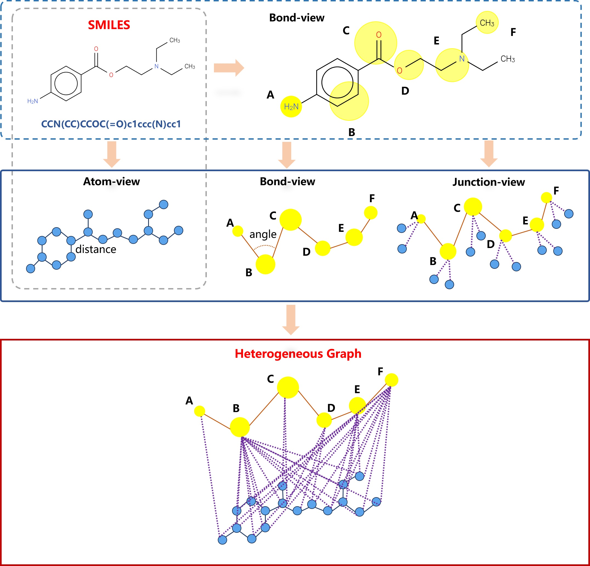

## Introduction
* Source code for the paper "Predicting molecular solubility with heterogeneous graph transformer network".

* we propose a message-passing-based heterogeneous graph neural network to predict the solubility properties of drug molecules. With a carefully designed multi-view heterogeneous graph, this model can learn more chemical information and structural information from molecules. 




## Dataset
All data used in this paper are publicly available on [Molecule-Net](http://moleculenet.org/datasets-1).

## Environment
* base dependencies:
 ```bash
 pip install -r requirements.txt
 ```

## Usage

#### Quick Run
For ESOL:
```bash
python train.py configs/esol.json
```
For FreeSolv:
```bash
python train.py configs/freesolv.json
```
For Lipo:
```bash
python train.py configs/lipo.json
```

